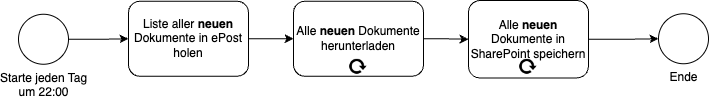
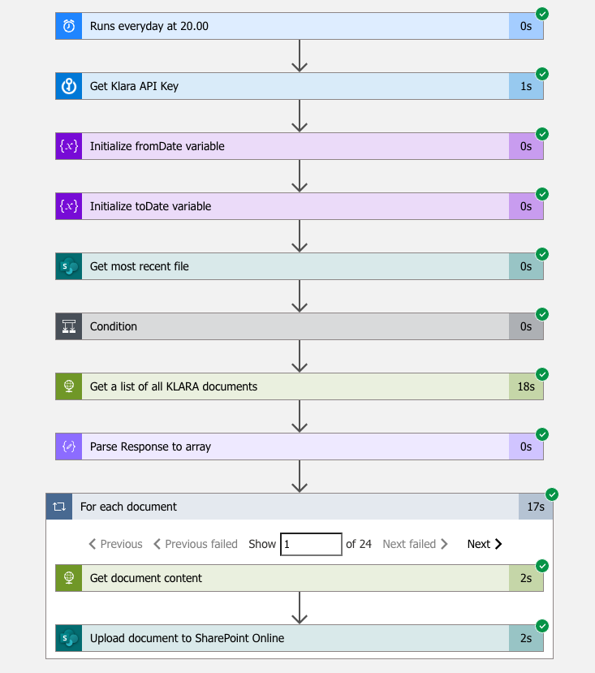

## Prozess-Digitalisierung: Das Gegenmittel gegen den Fachkräftemangel

In einer Welt, die zunehmend von Technologie und Daten geprägt ist, kann kein Unternehmen es sich leisten, den Trend der Prozess-Digitalisierung zu ignorieren. Dies wird umso deutlicher, wenn wir die wachsende Herausforderung des Fachkräftemangels miteinbeziehen. Die Digitalisierung von Geschäftsprozessen bietet nicht nur eine Chance, effizienter und wettbewerbsfähiger zu werden, sondern auch, den Mangel an qualifiziertem Personal zu kompensieren. Durch automatisierte Systeme, cloudbasierte Lösungen und innovative Algorithmen können Unternehmen Aufgaben und Workflows optimieren, was wiederum zu einer Entlastung des menschlichen Personals führt.

In diesem Blog Post möchte ich Anhand eines einfachen Beispiel's zeigen, wie Prozess Digitalisierung aussehen kann.

## Der Prozess

Bei unscripted nutzen wir das ePost Angebot der schweizerischen Post. Dies ermöglicht es uns, analoge Briefe durch die Post einscannen zu lassen. Wir können die Briefe danach von überall und zentral auf der Weboberfläche einsehen. Leider ist die Weboberfläche sehr limitiert, wir können die Briefe einsehen, herunterladen und manuelle Tags vergeben.

Wir sind nun mit einem typisches Problem von vielen SaaS Lösungen konfrontiert. Sie lösen ein Problem, jedoch schaffen sie Datensilos die man selbst integrieren muss. Dies ist vorallem für KMU's eine grosse Herausforderung, da oft das Know-How fehlt wie man die zur verfügung stehenden Schnittstellen nutzen kann.

In unserem Beispiel werden wir die Daten herunterladen und auf unsere eigene Datenablage speichern. Wir werden die No/Low-Code Plattform Azure Logic Apps verwenden um diesen Prozess abzubilden, da dieser viele Konnektoren für die Verbindung beliebter Services bietet.

## Herangehensweise

### Prozess dokumentieren

Um den Prozess zu digitalisieren müssen wir die involvierten Services identifizieren und verstehen, wie wir diese einbinden können. In unserem Beispiel haben wir zwei Services, den ePost Service und unsere Datenablage, in unserem Fall SharePoint. Danach zeichnen wir einen Prozessablauf auf um den Prozess visuell abzubilden. Ich habe diesen einfachen Prozess im untenstehenden BPMN Diagramm abgebildet.

 

An dieser stelle optimieren wir den Prozess noch ein wenig. Wir wollen ja nicht jedes mal alle Dokumente erneut herunterladen und speichern. Aktuell haben wir noch nicht viele Dokumente im ePost Portal aber nach einigen Geschäftsjahren werden sich dort einige Dokumente ansammeln. Deshalb wollen wir nur die neu hinzugefügten Dokumente herunterladen, was im untenstehenden Diagramm abgebildet ist.

 

### Prozess zur Implementierung

***Überspringe diesen Teil wenn dich der technische Aspekt nicht interessiert***

Nun müssen wir prüfen, wie wir diesen Prozess im Azure Logic App abbilden können. Um die Liste aller Dokumente zu erhalten und diese herunterzuladen gibt es keinen Standard Konnektor in Azure Logic App, deshalb müssen wir die API Schnittstelle der ePost verwenden.
Für SharePoint gibt es einen Konnektor in Azure Logic Apps, somit können wir die Datenablage einfach integrieren. 

Glücklicherweise hat ePost eine öffentlich zuängliche API [Dokumentation](https://api.klara.ch/docs#) (hier könnten sich einige SaaS Anbieter ein Beispiel nehmen). Mit der Dokumentation werden wir schnell fündig, die benötigen API Endpoints sind `/epost/v2/letters` und `​/epost​/v2​/letters​/{letter-id}​/content`.

#### Nach neuen Dokumenten filtern

Nun müssen wir uns überlegen, wie wir die die Dokumente filtern können, so das wir nur die noch nicht heruntergeladenen Dokumente erhalten. Im API Endpoint ***/epost/v2/letters*** gibt es die Möglichkeit Dokumente nach Datum zu filtern. Dies können wir verwenden um eine gefilterte Liste zu erhalten. Es würde auch anspruchsvollere Möglichkeiten geben, wie zum Beispiel eine separate Datenbank zu führen aller heruntergeladenen Dokumente und diese zum filtern verwenden. Da es sich hier um ein einfaches Beispiel handelt, werden wir den Datumsfilter verwenden.\
Um diesen Filter verwenden zu können, muss die Azure Logic App bei jeder durchführung wissen, wann sie das letzte mal durchgeführt wurde. Leider gibt es keine Datenpersistenz zwischen den einzelnen Azure Logic App durchführungen, also müssen wir diese Datenpersistenz selber abbilden. Hierfür haben wir verschiedene Möglichkeiten wie die Verwendung einer Azure SQL Datenbank, Azure Blob Storage oder die Verwendung eines Text Files in SharePoint. Da es sich um einen sehr einfachen Datensatz handelt den wir speichern wollen (letzte Erfolgreiche Durchführung des Azure Logic App's) und da wir bereit eine SharePoint Anbindung benötigen verwenden wir in diesem Beispiel das Text File in SharePoint. 

#### Authentifizierung

Natürlich müssen wir uns an der ePost API und in SharePoint auch Authentifizieren, sonst könnte jeder auch unsere gescannten Briefe zugreifen. \
Da SharePoint in Azure Logic App einen Konnektor hat, ist die Authentifizierung direkt integriert. Man kann sich mit OAuth mit einem Benutzer anmelden, welcher auf die gewünschte Fileablage Zugriff hat. Wir empfehlen hierfür einen dedizierten Benutzer zu verwenden, welcher nur auf die Fileablage Zugriff hat, auf welcher die Briefe gesichert werden sollen.
Für den API Zugriff der ePost muss ein API key generiert werden. Dieser kann im Portal der ePost erstellt werden. Nun müssen wir den noch irgendwo sicher ablegen. Ich möchte vermeiden, diesen als Klartext Variabel im Azure Logic App Workflow einzufügen, da dieser dort durch unbefugte ausgelesen werden könnte und diese so auf sensible Daten Zugriff erhalten. Daher verwenden wir Azure Keyvault um den API Key zu schützen. Azure Keyvault können wir auch im Azure Logic App mittels Konnektor einfach integrieren. Die Authentifizierung um den Azure Keyvault auszulesen wird über Access Policies des Azure Key Vaults gesteuert, wobei die Azure Logic App sich mit einer Managed Identity am Keyvault authentifizieren kann.

#### Azure Logic App Workflow

Jetzt können wir mit dem Azure Logic App Designer unseren Prozess digitalisieren! Ich habe den Prozess bereits abgebildet, wie dass aussieht sieht ihr in der untenstehenden Abbildung.

 

Gehen wir die einzelnen Punkte des Prozesses durch.

|Schritt|Typ|Beschreibung|
|---|---|---|
|1|Trigger|Hier definieren wie der Prozess gestartet wird. Es handelt sich hier um eine geplante Aktion die nach Zeitplan jeden Tag um 22.00 starten soll.|
|2|KeyVault Aktion|Hier lesen wir den API Key für die ePost API aus. Dieser wird in allen HTTP Requests für die ePost API benötigt.|
|3|SharePoint Aktion|Lese Textdatei auf SharePoint um das Datum der letzen erfolgreichen Durchführung der Azure Logic App zu erhalten. Hier ist wichtig zu beachten, dass das File nicht durch den Workflow erstellt wird. Es muss also vor der ersten Ausführung des Workflows vorhanden sein.|
|4|Variabel initialisieren|Hier definieren wir die Variabel fromDate. Diese wird benötigt um zu definieren welche Dokumente ab welchem Datum berücksichtig werden sollen. Die Variabel wird auf einen Tag nach dem Datum der letzten erfolgreichen Durchführung gesetzt.|
|5|Variabel initialisieren|Hier definieren wir die Variabel toDate. Diese wird benötigt um zu definieren welche Dokumente bis welches Datum berücksichtig werden sollen. Theoretisch brauchen wir diese Variabel nicht, da uns reichen würde zu definieren, dass wir nur Dokumente ab einem bestimmten Datum herunterladen um die bereits heruntergeladenen Dokumente zu ignorieren. Jedoch wird diese Variabel von der API benötigt, da sie sonst die Dokumente fromDate Variabel ignoriert und keinen Filter anwendet.|
|6|HTTP Request|Dieser HTTP Request nutzt den API Endpoint `/epost/v2/letters`, dieser gibt uns eine Liste aller Dokumente.|
|7|Parse JSON|Die Antwort aus dem HTTP Request wird hier zu JSON konvoriert, so dass wir diese in den Nachfolgenden Schritten brauchen können.|
|8|For-each Schleife|Diese Schleife geht die Liste aller Dokumente durch, die wir im vorherigen HTTP Request erhalten haben. Für jedes Dokument werden nun die Schritte 8.1 und 8.2 durchgeführt.|
|8.1|HTTP Request|Mit dem API Endpoint `/epost​/v2​/letters​/{letter-id}​/content` wird der Inhalt des Dokumentes heruntergeladen.|
|8.2|SharePoint Aktion|In diesem Schritt wird das hertuntergeladene Dokument in SharePoint hochgeladen. Die hochgeladenen Dateien werden mit Timestamp und Titel welcher von der API zurückgegeben wird benannt.|
|9|SharePoint Aktion|Schreibe heutiges Datum in SharePoint Text File für die nächste Durchführung.|

#### Testlauf

Nach dem der Prozess in Azure Logic App abgebildet ist und die nötigen Authentifizierungen vorgenommen wurden können wir einen Testlauf durchführen.
Im Screenshot ist zu sehen wie jeder Schritt erfolgreich durchläuft und die For-each Schleife einmal durchgeführt wird für ein Dokument.

 

## Resultat

Das Endresultat unserer Reise ist ein Ordner mit all den heruntergeladenen Dokumenten. Diese können weiter verwendet werden ohne sich in der ePost Weboberfläche anzumelden.

Uh oh! Was sehen wir denn da, alle Briefe sind mit dem Titel "Gescannter Brief" betitelt. Dies ist nicht wirklich hilfreich, da wir so jedes PDF aufmachen müssen um das gewünschte PDF zu finden. Das ist leider der ePost geschuldet. Jeder Brief der eingescannt wird, wird mit "Gescannter Brief" betitelt, die Inhalte der Briefe werden nicht verwendet um einen aussagekräftigen Titel zu generieren. Genau hier werden wir im zweiten Teil mit AI ansetzen.

 

## Fazit

Ich hoffe dieses einfache Beispiel hat dir einen Einblick in die Möglichkeiten der Digitalisierung von Prozessen gegeben und dich vielleicht sogar angeregt selber Prozesse in deinem Unternehmen zu digitalisieren.

Mit Azure Logic App ist es auch Personen möglich Prozesse zu digitalisieren ohne tiefgreifende Programmiererfahrung. Jedoch braucht es ein gewisses Technologie Verständnis und Neugier sich in neue Themen einzuarbeiten.

An diesem Punkt will ich auch erwähnen, dass der implementierte Prozess stark vereinfacht ist. Ich habe einfachheisthabler Checks wie zum Beispiel, die Überprüfung ob das Text File im SharePoint existiert nicht implementiert und es gibt auch kein wirkliches Error Handling. Bei einem Fehler in einem der Schritte wird der Prozess abgebrochen.

**Im zweiten Teil des Blogpost's machen wir den Prozess "smart" in dem wir AI Services nutzen.**

Falls du dich zu den Möglichkeiten der Digitalisierung austauschen möchtest, kannst du mich in [Microsoft Teams](https://link.unscripted.ch/teamschat_l) anchatten/anrufen oder per [Mail](mailto:loris@unscripted.ch) erreichen.

